# Pass Physics

The Pass physics website is a tool aimed at helping GCSE physics students better prepare for their exams in and outside of a school environment.
The website is intended to be used by both teaching staff and school pupils. The pupils will be able to answer exam questions on the many 
modules in physics GCSE and receive immediate feedback on their attempts. The website will provide an ideal method and solution to the problem
giving pupils the most efficient way to answer their problems. The site provides a class for the pupils to join (currently one of three) in
which they are able to compete against other pupils on a leader board to assist in motivating the pupils to study. 

The teaching staff have the ability to add their own questions to the database for their pupils if they feel there is a particular topic that
there pupils should have more of a focus on. The teachers will also have access to the class area where they are able to view the current progress
of their class. The questions mark themselves and will reduce the marking load for teachers as well as providing statistical feedback on how pupils are preforming.

### **Business and Developer Goals**
- To assist GCSE physics students in obtaining the best possible exam results. 
- To promote PhyRev so that more schools sign up to our website increasing business revenue
- To have project using a detailed database as part of his portfolio 

### **Student Goals**
- To give themselves the best chance of passing their physics GCSE by practicing questions
- To compete against other students to encourage repeat visits
- Promote the website by word of mouth with other students
### **Teacher Goals**
- To have a resource that gives students constructive feedback when attempting exam questions
- To have a resource that allows them to easily compare how their students are performing on exam questions
- To minimize marking load
## Table of Contents
1. [User Design](#ux)
2. [WireFrames](#wireframes)
3. [Features](#features)
4. [Data Structure](#data-structure)
5. [Technologies](#technologies-used)
6. [Testing](#testing)
7. [Deployment](#deployment)
8. [Credits](#credits)
## UX
---
### **Ideal User**
- Anyone studying towards GCSE physics
- Anyone with an interest in learning physics
- Any teachers of physics
- Any schools looking to expand their library of resources
### **User Stories**
As a student I want:
1. To easily be able to locate the questions I would like to practice
2. To see how I am performing compared to other users
3. To receive feedback after a incorrect question so I understand what I have done wrong
4. To see how well I am performing 
5. To be motivated to return to the website

As a teacher I want:
1. To be easily view the progress of students in my class
2. To be able to add and change questions easily to better suit my class
3.  To be able to communicate with my students using the website
4. To know the experience previous teachers have had using this website

As a general user I want:
1. The purpose of the site to be immediately clear
2. The site to be intuitive to use and navigate around
3. I want to easily be able to sign up to/login to the site. 
### **Design Choices**

### **Wireframes**
### Home Page
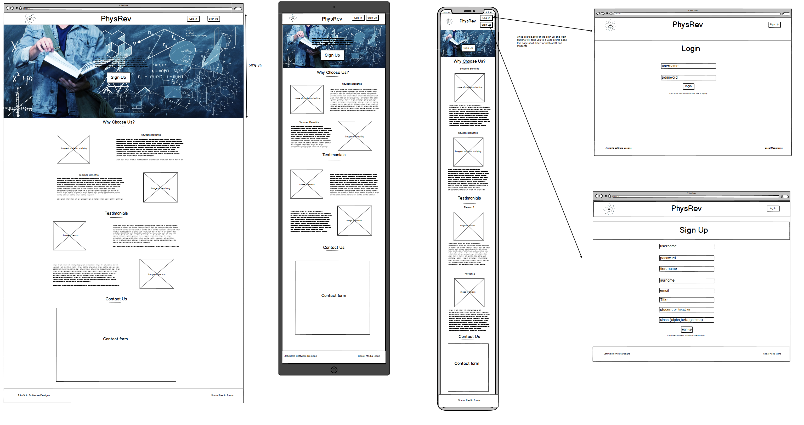
### Profile Page - Student View Only
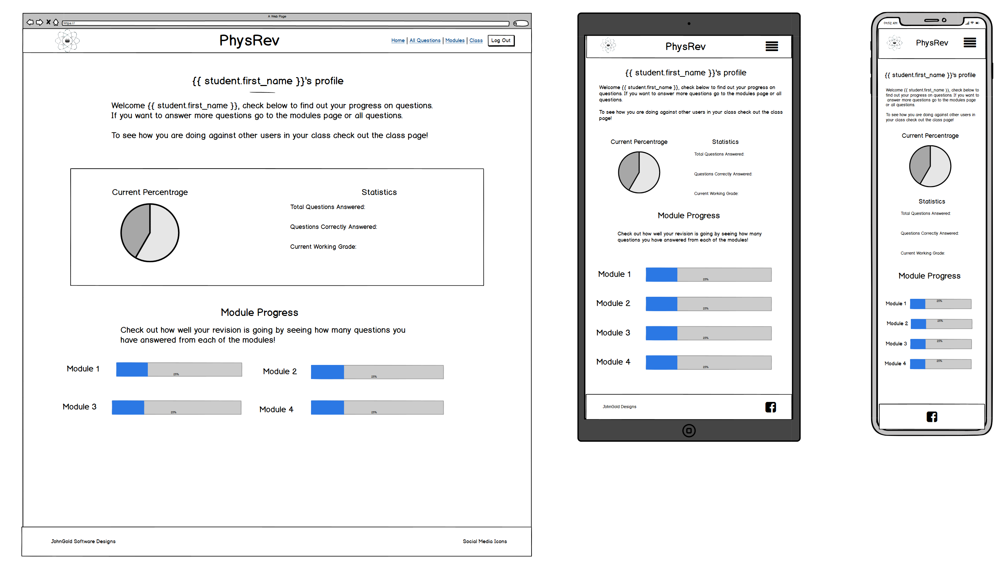
### Profile Page - Teacher View Only
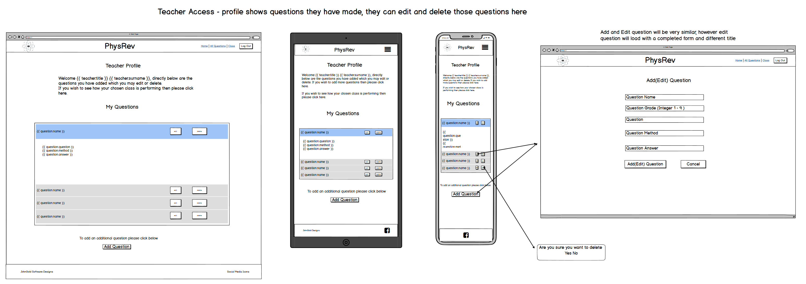
### Profile Page - Administrator View Only
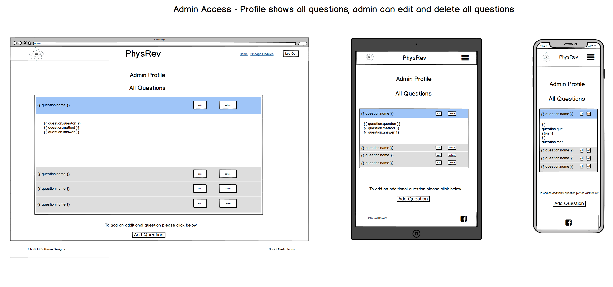
### All Questions Page
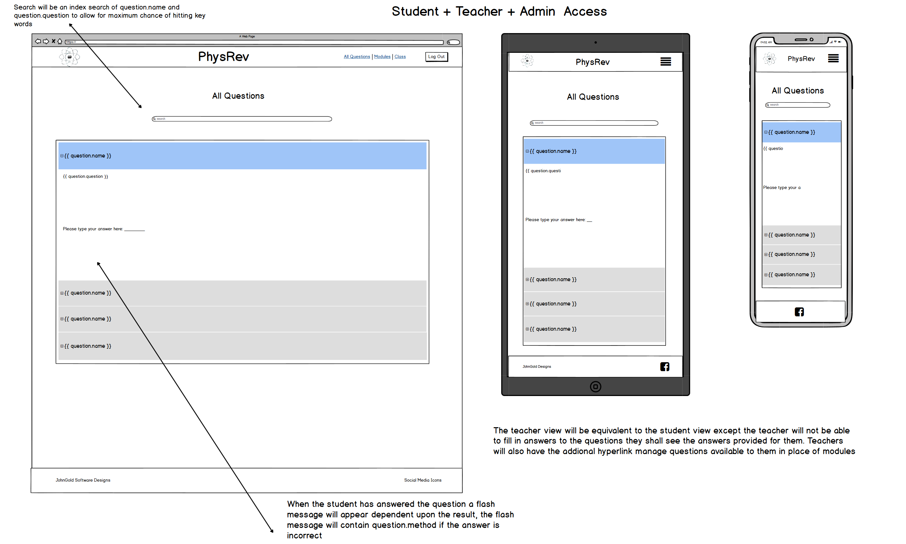
### Modules Page
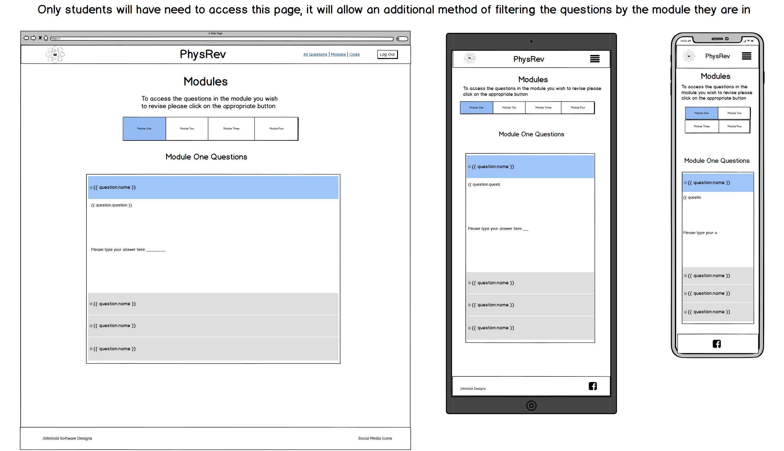
### Manage Modules Page - Admin only
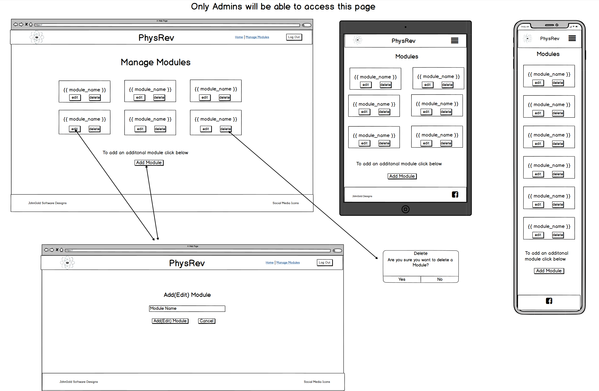
### Class Page - Student View Only
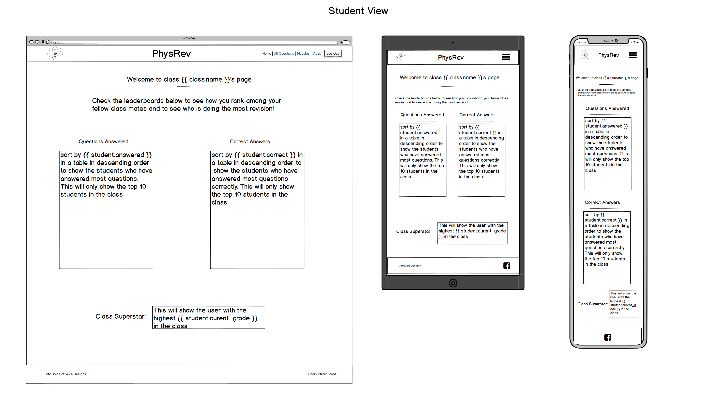
### Class Page - Teacher View Only
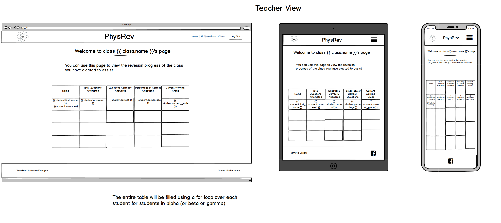
## Features
---
### **Existing Feautres**
---
#### Home Page
- Advertises the site and provides easy access to sign in/login to the user areas. 
#### Registration/Login
- A user is able to create a student or teacher account and can choose to join one of 3 classes when they sign up. 
- If the user has an account they are able to login
#### Profile Page
- Users will all have a unique profile page

- A teachers users profile will enable them to add/edit questions for their class. Teachers are only able to edit and delete their own questions.

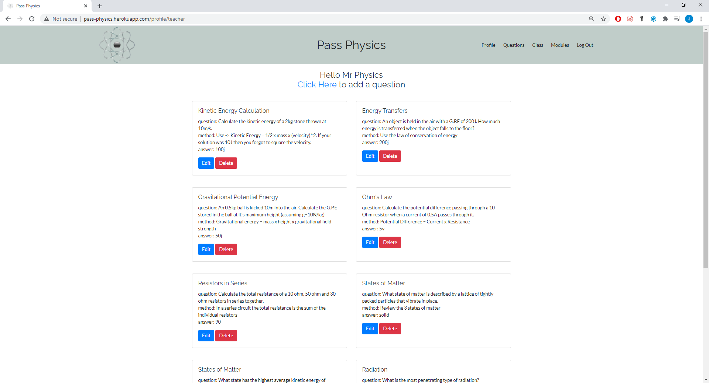

- An admin users profile page is identical to the teacher profile page however they are the only user able to edit and delete other teacher users questions. 

- A students profile displays some statics on how the student is perfoming.

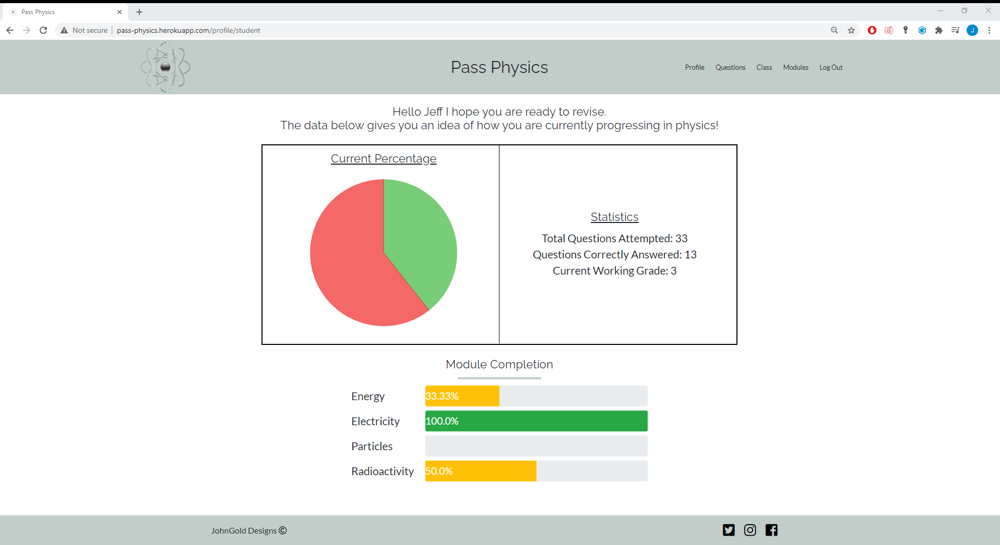
Jeff has completed all the electricity questions, 50%  of the radioactivity questions, a third of the energy questions and none of the particles questions. He can tell his current working grade and a pie chart represents his current performance. 

#### CRUD functionallity
- Teacher users can add, edit and delete questions there own questions
- When deleting questions from database defensive programming practices are implemented. 

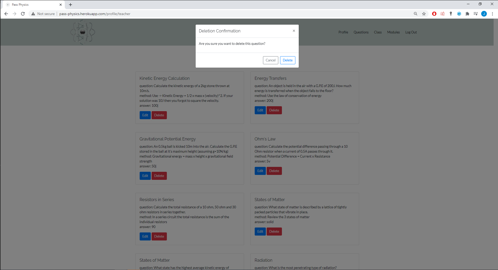

- Additionally admin users can add, edit and delete modules.

#### Questions page
- Teacher and admin users are simply able to view the quesitons left by all users and search through the questions using a search bar. 

- The questions page for students allows them to answer the questions, they can attempt an individual question as many times as they wish until they get the correcr answer. Students can search for specific questions to answer.

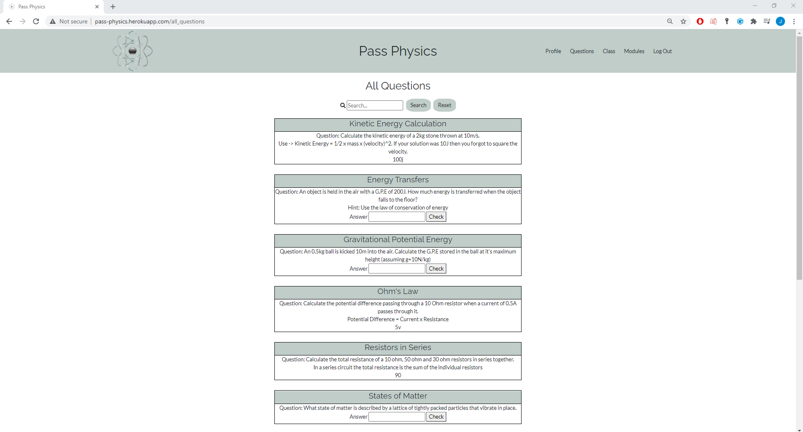

- The student view either provides the question and answer form to compelte, a question and method and a answer form to complete or a question, method and solution to the question. The dispaly changes based on whether a student has attempted a question, answered it incorrectly or answered it correctly. An example of all 3 views can be seen in the top 3 questions in the above screenshot.
### **Features left to implement** 

### **Differences from wireframes**


## **Data Structure**
---
A NoSQL database was used for this project. Please see the tables below for more information on each data type and my reason for using it and my database diagram which clearly shows the relationships between my different collections. 
### Database
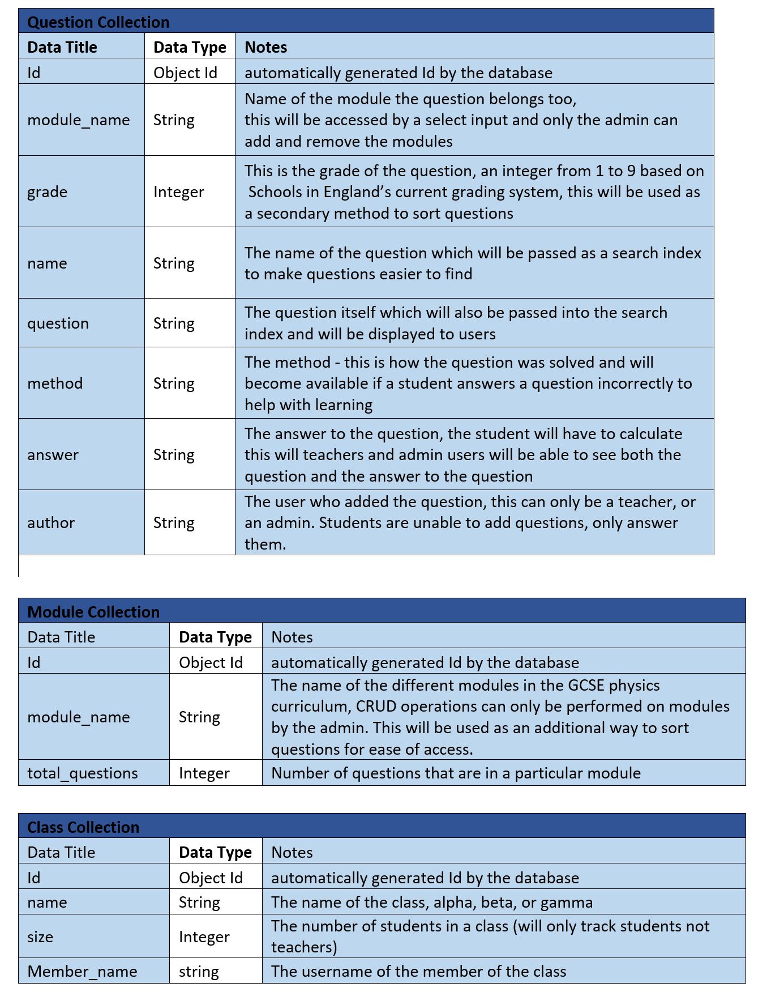 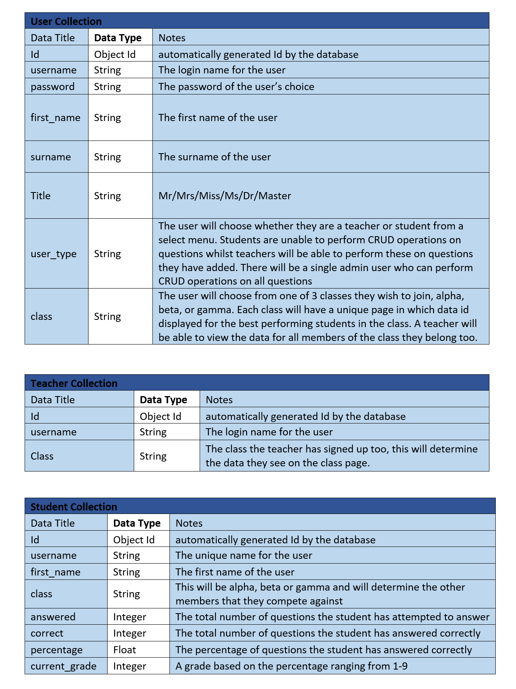
### Database Relationships - Inital 
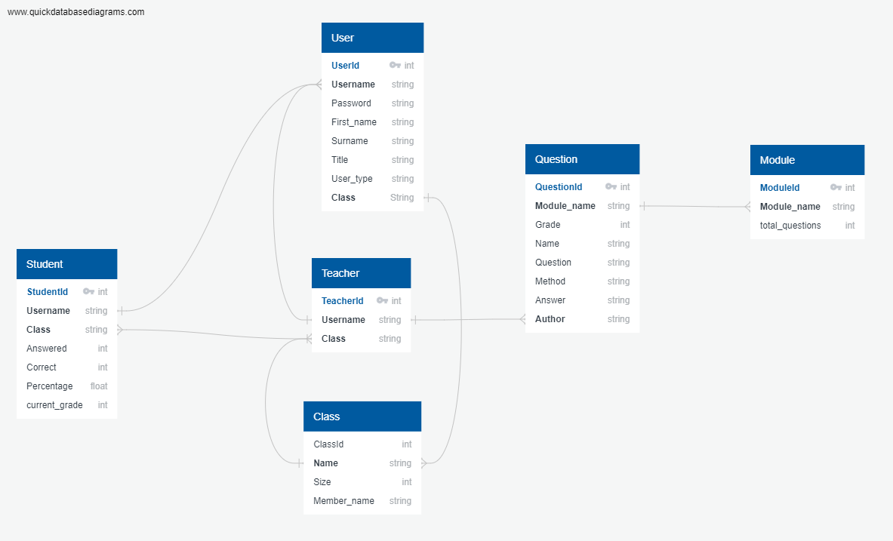
### Final Database and Relationships
The main changes in the final version fo the database is to the students collection.

Student users should be able to answer a question and if they get it incorret then a method should be displayed, if they get it correct then both the method and correct answer should be displayed. 

This was very diffiuclt to acheive with my intial database hence I changed to using 3 arrays, questions_unaswered is filled upon account creation with all question_ids from questions currently in the database and the other two arrays are initialised empty. question_ids are moved from questions_unanswered to either question_correct and questions_incorrect depending on the users response. This then allowed me a way to change what the user saw depending on the answer given.

The first_name and surname were added to the class section to allow for easier sorting of the students in the class section, however upon reflection this addition to the database was not required and can be removed as the duplication of this data is completly uneeded. 
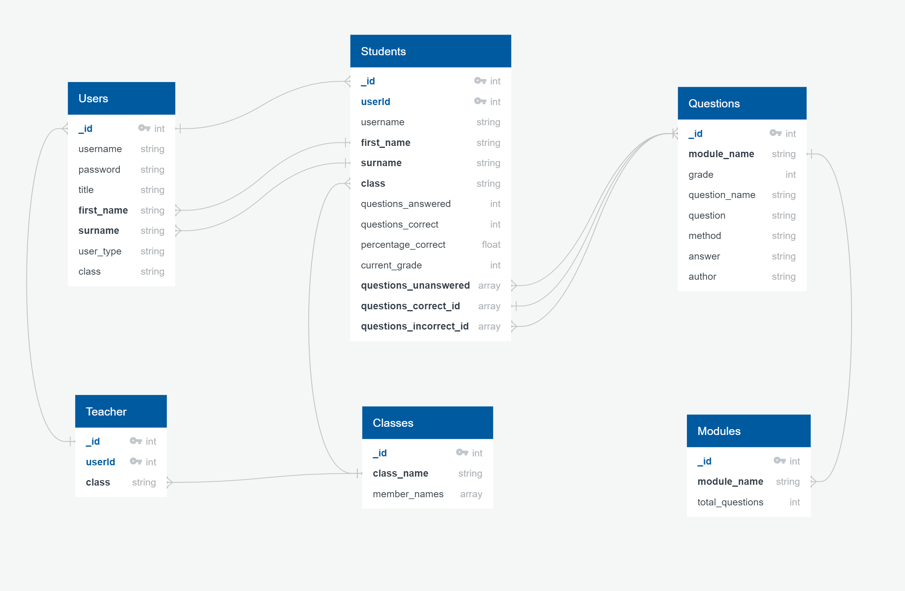
### Current Issues with database
The current database has 3 main issues:
1. Duplicated data - I have duplicated username, first_name and surname in the users and students collections to allow for easier coding at points. I have duplicated class in users, teachers and students, class only needs to be in one of these collections.  
2. Uneeded collections and data - As the class collection in teacher is duplicated the teacher collection is actually not required. The percentage_correct and current_grade information does not need to be stored in the collection as it can always be dynamically generated from questions_answered and questions_correct.
3. Student questions solution unideal - This soltuion lead to a complicated series of for loops and if statements in the all-questions section to allow me to display content as desired, re-writing the database could greatly simplfiy the all_quiestions.html. 
### Future Improvements to Database
1.	Duplicated data - To fix this issue I would remove first_name, surname and username from the students collection. I would also remove class from both the teachers and students collection. This would mean needing to change pages where student names are accessed from the student collection and adjusting my sorting function.
2.	Unneeded collections and data - I would entirely remove the teachers collection. Additionally I would remove the current_grade and percentage_correct values from the student. The values are already generated inside the program and can just be calculated when they are required as this uses much less memory than a database request.
3.	Student questions solutions unideal - I could completely change the students and questions collection. One solution would be to replace the students and questions collection with 2 collections - a table of questions and a table to record student answers. The student answers collection would store a record every time a student answers a question. The collection would store the students unqiue id, the unique question id, a boolean variable that indicated if the question was correctly answered and a score based on the weight of the question. You could use the boolean value to easily change the view and the number of items in the collection would be the number of questions attempted. Both collections being a table would you to access all questions at once; allowing for the submission of multiple questions.


## Technologies Used
---
This project used the languages Python (alongisde Jinjia tempalting), HTML5, javascript and CSS3.

- [jQuery](https://jquery.com/) - The jQuery library was used on all pages.
- [GitPod](https://gitpod.io/workspaces/) - The entire website was developed in GitPod
- [GitHub](https://github.com/) - GitHub was used to store the project and to deploy it using the master branch on the github site
- [Bootstrap](https://getbootstrap.com/) - The grid structure was used to structure the website and make it responsive and some default items in bootstrap were used as a starting point.
- [FontAwesome](https://fontawesome.com/) - Font Awesome was used for various icons throughout the side.

## Testing
---
**For the testing please see [testing.md](TESTING.md)**


## Deployment
---
The project was hosted on Github and deployed through heroku. 

### Requriements to deploy the project are a:
- Python 3 developing environment
- Github account
- MongoDB account
- Heroku account 

### Step 1 - Clone my repository
- To clone my repository you first need to logged into github and go to [my repository](https://github.com/JohnGC1510/milestone_project_3)
- Click on the "code" button just above the files

- Click "Open with GitHub Desktop" and follow the instructions in the GitHub desktop application. Other ways to clone a repository can be found [here](https://docs.github.com/en/github/creating-cloning-and-archiving-repositories/cloning-a-repository#cloning-a-repository-to-github-desktop) 

### Step 2 - Working with local clone
-  To work with the local clone you need to ensure all enviromental variables have been set in an env.py file. These variables are private so ensure that you have a .gitignore file that prevents your env.py file being pushed to github. An example of a env.py file can be seen below:
```
import os
os.environ.setdefault("IP", "0.0.0.0")
os.environ.setdefault("PORT", "5000")
os.environ.setdefault("SECRET_KEY", "***************")
os.environ.setdefault("MONGO_URI", "***********")
os.environ.setdefault("MONGO_DBNAME", "jargon_dict") 
```

- When cloning the project you should cloned the requiremnts.txt file, if this is not the case then use the following command in the CLI:
```
$ pip3 freeze -- local > requirements.txt
```
This file will contain a list of dependencies for the project. These can be installed with the following command in the CLI:
```
$ pip install -r requirements.txt
```

- Ensure you have a procfile as this will tell heroku how to run the application. A procfile can be created in the CLI using:
```
$ echo web: python app.py > Procfile
```

- Ensure you have added and pushed both the procfile and the requriments.txt file using git add . git commit and git push.

- Finally ensure you have created your database in MongoDB with the following collections:
    1. users
    2. students
    3. questions
    4. modules
    5. class
    6. teachers

- You should now be able to run the project locally using:
```
$ python3 app.py
```
### Step 3 - Deploying to Heroku
The project will automatically deploy to heroku after the following has been completed:
- Open you are logged in to Heroku create a new app selecting the appropriate region.

- Deployment method "GitHub" (if this section is accidentally missed, you can use the tab selection within your dashboard "DEPLOY")

- Select the "connect to GitHub" button and search for your repository using the form provided.

Once you have connected your GitHub repository:
- Navigate to the "Settings" tab:
- Scroll to the section "Config Vars" and click "reveal config vars" button:
    - Input all data found in your env.py file into this section. 
    - An example using my earlier example of an env.py file would be a config var with a key of IP and with a value of 0.0.0.0
- Navigate back to the "Deploy" tab:
    - Scroll to automatic deploys and enable automatic deployment.
    - Scroll to the "Manual Deploy" tab:
        1. Select the branch you wish to deploy (master is default)
        2. Click the "Deploy Branch" button. (This may take some time as Heroku uploads the app to their servers.) 

- Once the build is complete, a "View App" button will appear and you should be informed that the app has succesfully deployed.

- Common issues include outdated requirements.txt and/or missing Procfile, if errors occur, check these are both correct before investigating further 


## Credits
---
### **Code**

### **Media**

### **Infomration**

### **Acknowledgements**
- My mentor Ignatius for his fantastic support and assistance.
- The slack community for their continued support.
