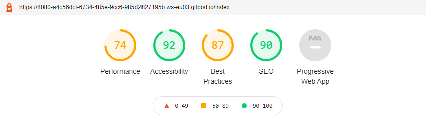
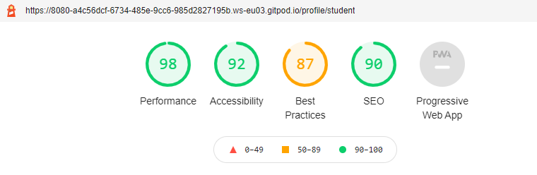
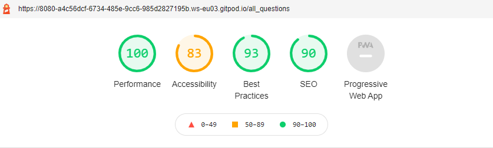
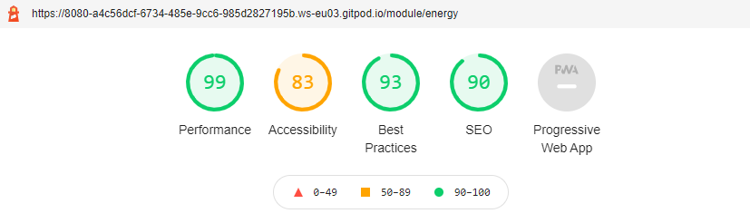
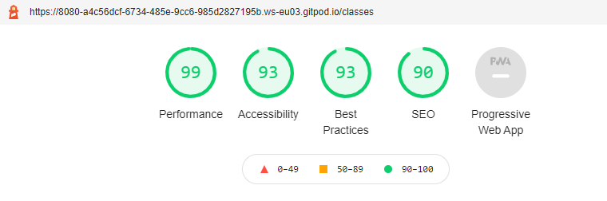
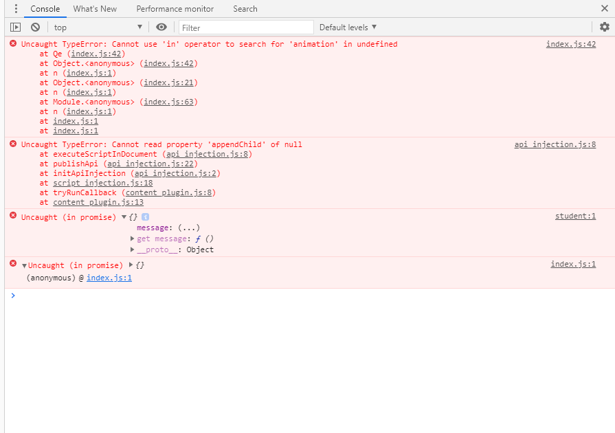

# Testing

## Table of Contents
---
* [Navigation](#navigation)
* [Home Page](#index)
* [User pages](#user-pages)
    + [Profile Page](#profile-pages)
    + [Questions Page](#questions-page)
    + [Class Page](#class-page)
    + [Modules Page](#modules-page)
    + [Error Pages](#error-pages)
* [Performance](#performance)
* [Validators](#code-validation)
    + [HTML](#html)
    + [CSS](#css)
    + [JavaScript](#javascript)
* [PEP8](#pep8)
* [Compatibility](#compatibility)
    + [Hardware](#hardware)
    + [Browsers](#browsers)
* [User Stories](#user-stories)
    + [Student User](#student-user)
    + [Teacher User](#teacher-user)
    + [General User](#general-user)
* [Known Bugs](#known-bugs)

Testing was performed manually for the full site. 

### **Navigation**
---
- All links have been tested for admin, student and teacher users and no broken links were discovered. 
- If a student user attempts to access a part of the site they do not have permissions for (adding questions etc.) they are re-directed to a page informing them off their lack of permissions and offering navigation to their profile page
- If a guest users attempts to access the main parts of the website they are re-directed to a page that asks them to sign-up/login
- Navigation bar displays correct items depending if the user is logged in or out 
- Navigation bar displays the correct items depending on the type of user logged in
---
### **Index**
- Page displays correctly and is only shown if the user is not logged into the site. 
#### Login / Register
- Login and register functionality extensively tested, a bug was recently found where capitalized passwords were not accepted as I mistakenly applied .lower() to the password received from the login form. This has now been fixed. - Register form feedback has been tested for all fields and the correct feedback displays when a user fills in field incorrectly and then submits the form.  

### **User Pages**
---

#### Profile Pages
-   The student profile page was tested to check that when a answers a question correctly or incorrectly the relevant values in the database are updated and the statistics shown to the user update with them. This is the case for all but the working grade displayed too the user, their is a bug that means that the user needs to refresh the browser after navigating to the profile page to show the updated value of the working grade. I currently have been unable to find a fix for this bug. 

- The progress bars on the students profile page were tested by editing, adding and removing questions from specific modules to check if progress bar filled and updated correctly. The progress bars update correctly for all CRUD operations performed on questions. 
 
 - The progress bars are not dynamically generated, so when a new module is added the progress bar needs to be manually added into the profile function which is highly inefficient however I have yet to be able to find a solution to dynamically generate the progress bars correctly. 

 - On the teacher and admins profile page adding, editing and deleting questions instantly adds/edits/deletes the displayed questions on the page and the database is correctly updated.

#### Questions Page

- Bug: My initial data structure made it difficult to present the question, question method or the solution based on if the student had not answered the question, had attempted it incorrectly or gotten the question correct as there was no unique way to determine if a student had answered a question. An initial change was adding an array to the students table storing the question_id of the questions the students had attempted. This appeared to work initially as when a question was answered the solution appeared and the rest of the questions remained unchanged, however this had its own bugs. Answers/unanswered questions/question methods displaying multiple times if answered incorrectly multiple times or multiple correct questions were answered as I was looping over the array of questions answered and over all questions without appropriate if conditions.  

- Solution - I removed the question_answered array from the student table and replaced this with 3 arrays questions_unanswered, questions_correct and questions_incorrect. When a student was initially created the i_d of all current questions in the database would be added to the questions_unanswered array and the questions_correct, questions_incorrect arrays were both initialised empty. Question ids are moved between the arrays based on how the student answers the question. This allowed me to create a set of if conditions that covered all possible circumstances of answers (all correct, all incorrect, some correct etc.) which meant no duplication of methods/answers as there was always 1 unique outcome for each if condition. This now functions as intended with students able to attempt questions multiple times and no duplicates of a question/method/answer ever appear.

- This page has been tested with multiple users answering all questions correctly,incorrectly and combinations of both and the information displayed to the user is correct. 

- The database correctly updates depending if the user answers a question correctly or incorrectly.

#### Class Page
- The tables in the class page update correctly as new users are added for a teacher user.
- The tables in the class page update correctly when a student user answers questions for both student and teacher users.
#### Modules Page
- As you click on the module button the appropriate questions appear based on the module filter
- Editing/adding/deleting questions in the database is correctly reflected on the modules page
- Adding modules is correctly reflected in the modules page. 
- Editing modules is not correctly reflected in the modules page - the edit modules function requires updating so that when a module is edited all of the questions are looped through and the module name is updated in each question. The student progress bars are also not dynamically created so editing a module will also require you to update the profile function appropriately. 
- Editing modules also removes the 'total_questions' integer from the collection, causing the site to break due to a key error, this clearly has been very poorly implemented hence the option to edit modules has been removed. 
- Deleting a module has not been well implemented and badly effects the sites functionality, due to this I have removed the option to delete a module as it will very rarely be necessary as the physics GCSE modules have not changed in years. However if deleting a module was to be implemented I would need to ensure any questions associated with that module would also be deleted as well as the progress bars and any associated data. 
- It is important to note only admin users were able to edit and delete modules so removing these 2 features will have very little impact on a day to day user of the site however they would be vital for long term site maintenance. 

### Error Pages
- The 404 error page has been tested and functions correctly 
- The 500 error page has been tested and functions correctly

## **Performance**
---
I tested the websites performance using Google lighthouse within the chrome developer tools. The tests can be seen below:








- The performance on the home page is poor compared to the rest of the site due to the size of the image files used on the home page.

- The issue preventing the accessibility from scoring 100 on most pages is the heading elements are not in a sequentially descending order.

- On the Modules and All questions page the accessibility is 83, this was due to non-unique Aria ID's. I could not find a way to avoid this as it is occurs within for loops on the pages using the Jinja Templating language. 
## **Code Validation**
---

### HTML
- All pages would fail HTML validation using the [HTML W3 validator](https://validator.w3.org/nu/#textarea) due to errors caused by Jinja Templating langauge. No errors or warnings occur other than those caused by use of Jinja Templating were found on any of the template pages.

### CSS

- No errors were found when the style.css page was passed for the [W3 CSS validator](https://jigsaw.w3.org/css-validator/validator)

### JavaScript
- I tested my javascript using [JS hint](https://jshint.com/) and it passed with the following two warning
```
8	'let' is available in ES6 (use 'esversion: 6') or Mozilla JS extensions (use moz).
9	'template literal syntax' is only available in ES6 (use 'esversion: 6').
``` 
- The console errors below appear when you load the student profile page, I beleive it is caused by the generation of the pie chart however I was unable to remove the errors. These errors appear to have no impact on the performance of the site. 

### PEP8
- The python code file is fully PEP8 compliant and passed the [PEP8 online](http://pep8online.com/) validation.

## Compatibility
---
### Hardware
I personally tested the website on:
- a windows system with a 4k and HD displays.
- A chromebook with a 1366x768 display
- A google pixel 5 mobile device
- An Ipad Pro

My family also tested on a number of different mobile devices and laptops. 

No issues were found on any devices during testing. 

### Browsers
I personally tested the website on:
- Google chrome
- Microsoft Edge
- Firefox

Family and friends tested on Safari. 

No browser specific issues were found during testing.
## User Stories
---
### Student User
1. As a student I want to easily be able to locate the questions I would like to practice 

Achieved, the student has a search bar based on the questions name and the question itself to allow filtering. In addition, there is a modules page that allows the students to filter the questions by the different GCSE modules.  

2. As a student I want to see how I am performing compared to other users: 

Achieved, on the class page each student can view how they are performing on a leader board of their class mates in terms of total questions answered and total questions correct. In addition, students are giving a working grade estimate which is a countrywide comparison tool.  

3. As a student I want to receive feedback for an incorrect question to understand what I have done: 

Partially Achieved, If you answer a question incorrectly then the site will provide you with a method to follow or a hint that will enable you to answer that question. However, this hint is generic for all users, this could be further improved on by having a bank of common incorrect answers and an appropriate response based on the incorrect answer.  

4. As a student I want to see how well I am doing: 

Achieved, the students profile page has a pie chart showing percentage of correctly answered questions for a clear and immediate update. The profile page also includes some basic statistics of how the student is performing as well as a working grade. Finally, a progress bar for each module is at the bottom of the profile page so students can see how much they have left to complete.   

5. As a student I want to be motivated to return to the website: 

Partially Achieved, the profile page provides a progress bar to show users how much they have completed and to push them to try reach 100% completion in all modules. The class leader board also offers competition which is an incentive to return to the site.  

### Teacher User

6. As a teacher I want to be easily able to view the progress of students in my class: 

Achieved, the teacher view of the class page shows an alphabetized (to represent class registers) table of data for the students showing working grades, questions attempted etc.  

7. Teachers want to be able to add and change questions easily to better suit their class 

Achieved, the profile page of the teacher allows them to view, add and edit there own questions.  

8. To be able communicate with my students using the website 

Not Achieved, adding a chat function/direct messaging function to allow teachers to message their students would have been ideal however it ended up being outside the scope of this project.  

9. As a teacher I want to know the experience previous schools/teachers have had using this website: 

Partially achieved, quotes on the homepage from past users highlight how some users have found success using the website.  

### General User

10. As a general user I want the purpose of the site to be immediately clear 

Achieved, clear hero image and captions demonstrate the side is about education and the name of the site/quotes make it clear it is a physics revision site.  

11. As a general user I want the site to be intuitive to use and navigate around: 

Achieved, icons change colour if they are hyperlinks, nav bar is clearly labelled and easy to use, it is always clear which part of the site you are on and how to navigate to a different page.   

12. As a general user I want the site be easily able to sign up/login to the site 

Achieved, clear navigation bar and sign up button make it easy to find and the form is structured clearly with clear instructions for the requirements of each part of the form that needs completing.

## Known Bugs
---
- Editing modules does not update the modules in the questions collection causing errors to occur. 
- Editing modules removes the total_questions data from that modules collection breaking the site
- Deleting a module causes a key error breaking the site as all other associated data values are not deleted. 


  

